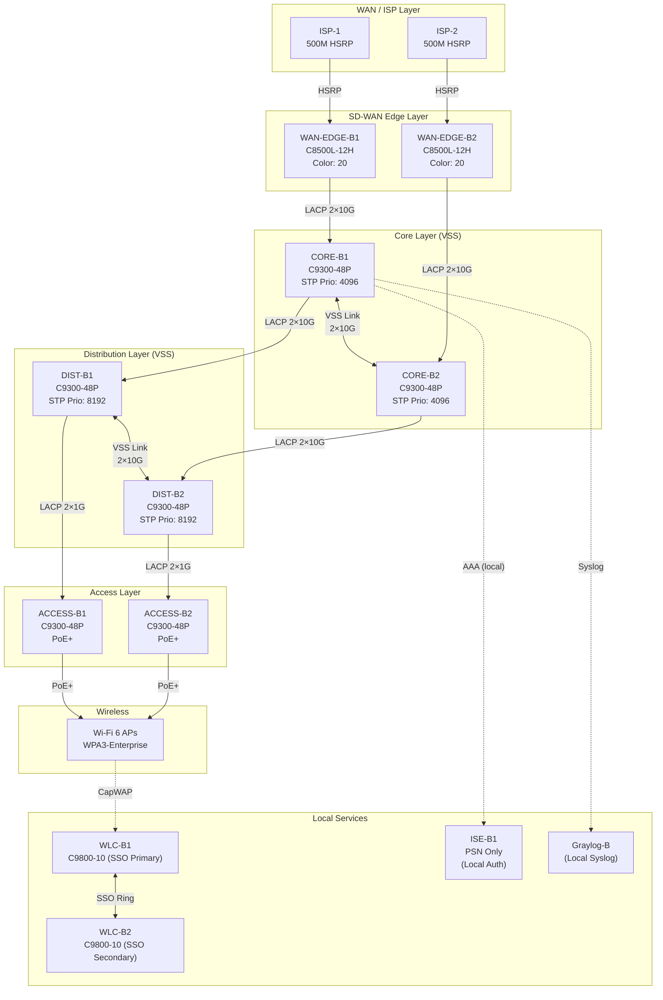
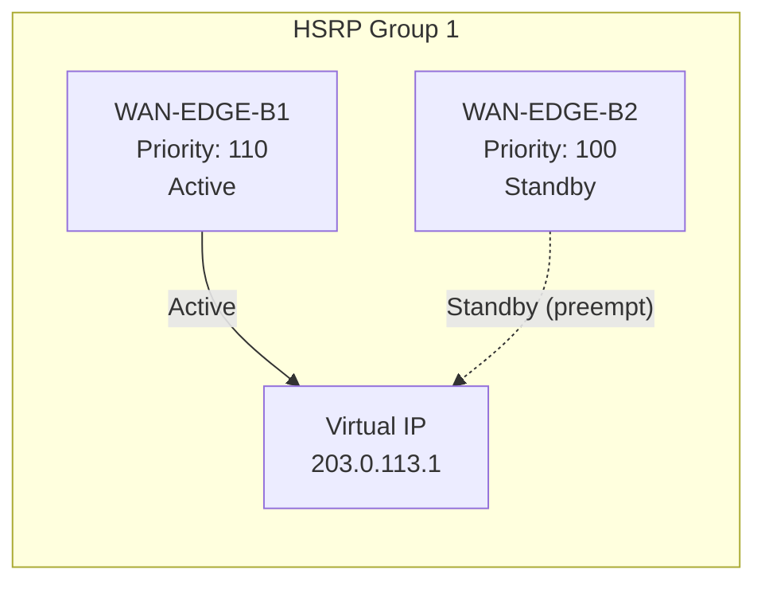

# Office B (Regional) — Network Diagram

## Architecture

```mermaid
flowchart TB
    subgraph WAN["WAN / ISP Layer"]
        ISP1["ISP-1<br/>500M HSRP"]
        ISP2["ISP-2<br/>500M HSRP"]
    end

    subgraph SDWAN["SD-WAN Edge Layer"]
        WEB1["WAN-EDGE-B1<br/>C8500L-12H<br/>Color: 20"]
        WEB2["WAN-EDGE-B2<br/>C8500L-12H<br/>Color: 20"]
    end

    subgraph CORE["Core Layer (VSS)"]
        CORE1["CORE-B1<br/>C9300-48P<br/>STP Prio: 4096"]
        CORE2["CORE-B2<br/>C9300-48P<br/>STP Prio: 4096"]
        CORE1 <-->|"VSS Link<br/>2×10G"| CORE2
    end

    subgraph DIST["Distribution Layer (VSS)"]
        DIST1["DIST-B1<br/>C9300-48P<br/>STP Prio: 8192"]
        DIST2["DIST-B2<br/>C9300-48P<br/>STP Prio: 8192"]
        DIST1 <-->|"VSS Link<br/>2×10G"| DIST2
    end

    subgraph ACCESS["Access Layer"]
        ACC1["ACCESS-B1<br/>C9300-48P<br/>PoE+"]
        ACC2["ACCESS-B2<br/>C9300-48P<br/>PoE+"]
    end

    subgraph AP["Wireless"]
        AP1["Wi-Fi 6 APs<br/>WPA3-Enterprise"]
    end

    subgraph SERVICES["Local Services"]
        WLC1["WLC-B1<br/>C9800-10 (SSO Primary)"]
        WLC2["WLC-B2<br/>C9800-10 (SSO Secondary)"]
        ISE3["ISE-B1<br/>PSN Only<br/>(Local Auth)"]
        LOG["Graylog-B<br/>(Local Syslog)"]
    end

    ISP1 -->|"HSRP"| WEB1
    ISP2 -->|"HSRP"| WEB2
    WEB1 -->|"LACP 2×10G"| CORE1
    WEB2 -->|"LACP 2×10G"| CORE2
    CORE1 -->|"LACP 2×10G"| DIST1
    CORE2 -->|"LACP 2×10G"| DIST2
    DIST1 -->|"LACP 2×1G"| ACC1
    DIST2 -->|"LACP 2×1G"| ACC2
    ACC1 -->|"PoE+"| AP1
    ACC2 -->|"PoE+"| AP1

    WLC1 <-->|"SSO Ring"| WLC2
    AP1 -.->|"CapWAP"| WLC1
    CORE1 -.->|"AAA (local)"| ISE3
    CORE1 -.->|"Syslog"| LOG
```

## HSRP Failover

```mermaid
flowchart LR
    subgraph HSRP["HSRP Group 1"]
        R1["WAN-EDGE-B1<br/>Priority: 110<br/>Active"]
        R2["WAN-EDGE-B2<br/>Priority: 100<br/>Standby"]
        VIP["Virtual IP<br/>203.0.113.1"]
    end

    R1 -->|"Active"| VIP
    R2 -.->|"Standby (preempt)"| VIP
```   
