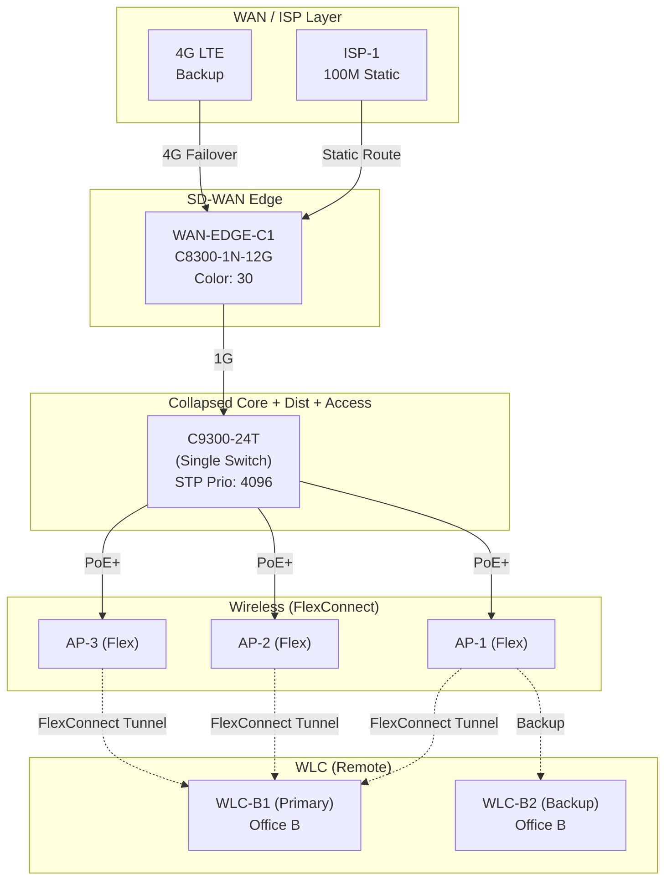
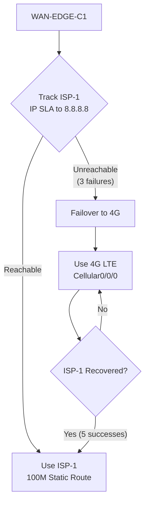

# Office C (Branch) — Network Diagram

## Architecture (Collapsed)

```mermaid
flowchart TB
    subgraph WAN["WAN / ISP Layer"]
        ISP1["ISP-1<br/>100M Static"]
        ISP2["4G LTE<br/>Backup"]
    end

    subgraph SDWAN["SD-WAN Edge"]
        WEC1["WAN-EDGE-C1<br/>C8300-1N-12G<br/>Color: 30"]
    end

    subgraph COLLAPSED["Collapsed Core + Dist + Access"]
        SW1["C9300-24T<br/>(Single Switch)<br/>STP Prio: 4096"]
    end

    subgraph AP["Wireless (FlexConnect)"]
        AP1["AP-1 (Flex)"]
        AP2["AP-2 (Flex)"]
        AP3["AP-3 (Flex)"]
    end

    subgraph WLC["WLC (Remote)"]
        WLCB1["WLC-B1 (Primary)<br/>Office B"]
        WLCB2["WLC-B2 (Backup)<br/>Office B"]
    end

    ISP1 -->|"Static Route"| WEC1
    ISP2 -->|"4G Failover"| WEC1
    WEC1 -->|"1G"| SW1
    SW1 -->|"PoE+"| AP1
    SW1 -->|"PoE+"| AP2
    SW1 -->|"PoE+"| AP3

    AP1 -.->|"FlexConnect Tunnel"| WLCB1
    AP2 -.->|"FlexConnect Tunnel"| WLCB1
    AP3 -.->|"FlexConnect Tunnel"| WLCB1
    AP1 -.->|"Backup"| WLCB2
```

## 4G Failover Logic

```mermaid
flowchart TD
    START["WAN-EDGE-C1"] --> TRACK{"Track ISP-1<br/>IP SLA to 8.8.8.8"}
    TRACK -->|"Reachable"| PRIMARY["Use ISP-1<br/>100M Static Route"]
    TRACK -->|"Unreachable<br/>(3 failures)"| FAIL["Failover to 4G"]
    FAIL --> BACKUP["Use 4G LTE<br/>Cellular0/0/0"]
    BACKUP --> RECOVER{"ISP-1 Recovered?"}
    RECOVER -->|"Yes (5 successes)"| PRIMARY
    RECOVER -->|"No"| BACKUP
```   
