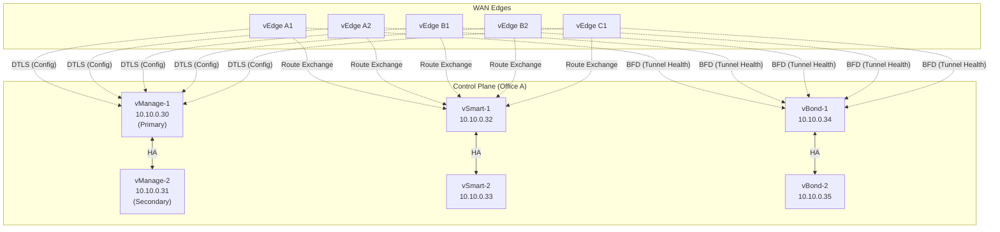
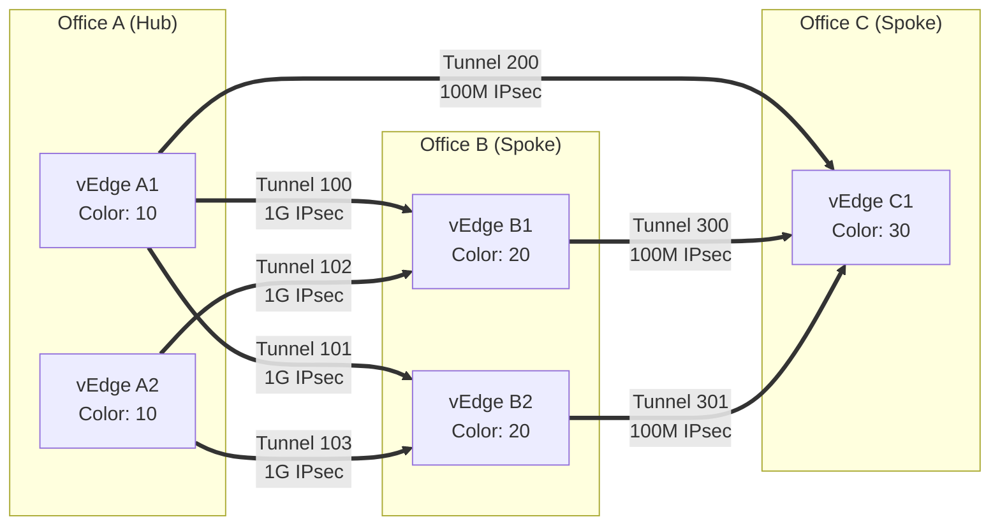
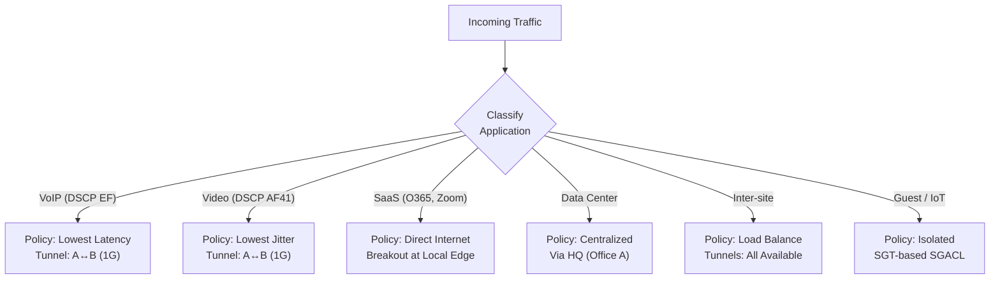

# Catalyst SD-WAN Fabric Design

## Control Plane

```mermaid
flowchart TB
    subgraph CONTROL["Control Plane (Office A)"]
        VM1["vManage-1<br/>10.10.0.30<br/>(Primary)"]
        VM2["vManage-2<br/>10.10.0.31<br/>(Secondary)"]
        VS1["vSmart-1<br/>10.10.0.32"]
        VS2["vSmart-2<br/>10.10.0.33"]
        VB1["vBond-1<br/>10.10.0.34"]
        VB2["vBond-2<br/>10.10.0.35"]
    end

    subgraph EDGES["WAN Edges"]
        A1["vEdge A1"]
        A2["vEdge A2"]
        B1["vEdge B1"]
        B2["vEdge B2"]
        C1["vEdge C1"]
    end

    VM1 <-->|"HA"| VM2
    VS1 <-->|"HA"| VS2
    VB1 <-->|"HA"| VB2

    A1 & A2 & B1 & B2 & C1 -.->|"DTLS (Config)"| VM1
    A1 & A2 & B1 & B2 & C1 -.->|"BFD (Tunnel Health)"| VB1
    A1 & A2 & B1 & B2 & C1 -.->|"Route Exchange"| VS1
```

## Data Plane (Tunnels)

```mermaid
flowchart LR
    subgraph SITE_A["Office A (Hub)"]
        A1["vEdge A1<br/>Color: 10"]
        A2["vEdge A2<br/>Color: 10"]
    end

    subgraph SITE_B["Office B (Spoke)"]
        B1["vEdge B1<br/>Color: 20"]
        B2["vEdge B2<br/>Color: 20"]
    end

    subgraph SITE_C["Office C (Spoke)"]
        C1["vEdge C1<br/>Color: 30"]
    end

    A1 ==>|"Tunnel 100<br/>1G IPsec"| B1
    A1 ==>|"Tunnel 101<br/>1G IPsec"| B2
    A2 ==>|"Tunnel 102<br/>1G IPsec"| B1
    A2 ==>|"Tunnel 103<br/>1G IPsec"| B2
    A1 ==>|"Tunnel 200<br/>100M IPsec"| C1
    B1 ==>|"Tunnel 300<br/>100M IPsec"| C1
    B2 ==>|"Tunnel 301<br/>100M IPsec"| C1
```

## App-Aware Routing

```mermaid
flowchart TD
    TRAFFIC["Incoming Traffic"] --> CLASSIFY{"Classify<br/>Application"}

    CLASSIFY -->|"VoIP (DSCP EF)"| POLICY1["Policy: Lowest Latency<br/>Tunnel: A↔B (1G)"]
    CLASSIFY -->|"Video (DSCP AF41)"| POLICY2["Policy: Lowest Jitter<br/>Tunnel: A↔B (1G)"]
    CLASSIFY -->|"SaaS (O365, Zoom)"| POLICY3["Policy: Direct Internet<br/>Breakout at Local Edge"]
    CLASSIFY -->|"Data Center"| POLICY4["Policy: Centralized<br/>Via HQ (Office A)"]
    CLASSIFY -->|"Inter-site"| POLICY5["Policy: Load Balance<br/>Tunnels: All Available"]
    CLASSIFY -->|"Guest / IoT"| POLICY6["Policy: Isolated<br/>SGT-based SGACL"]
```   
