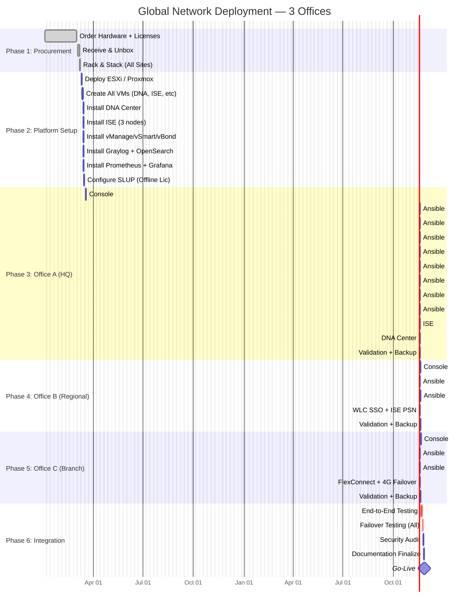
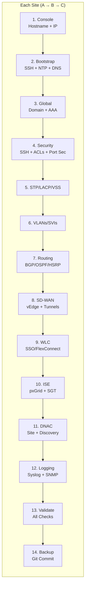
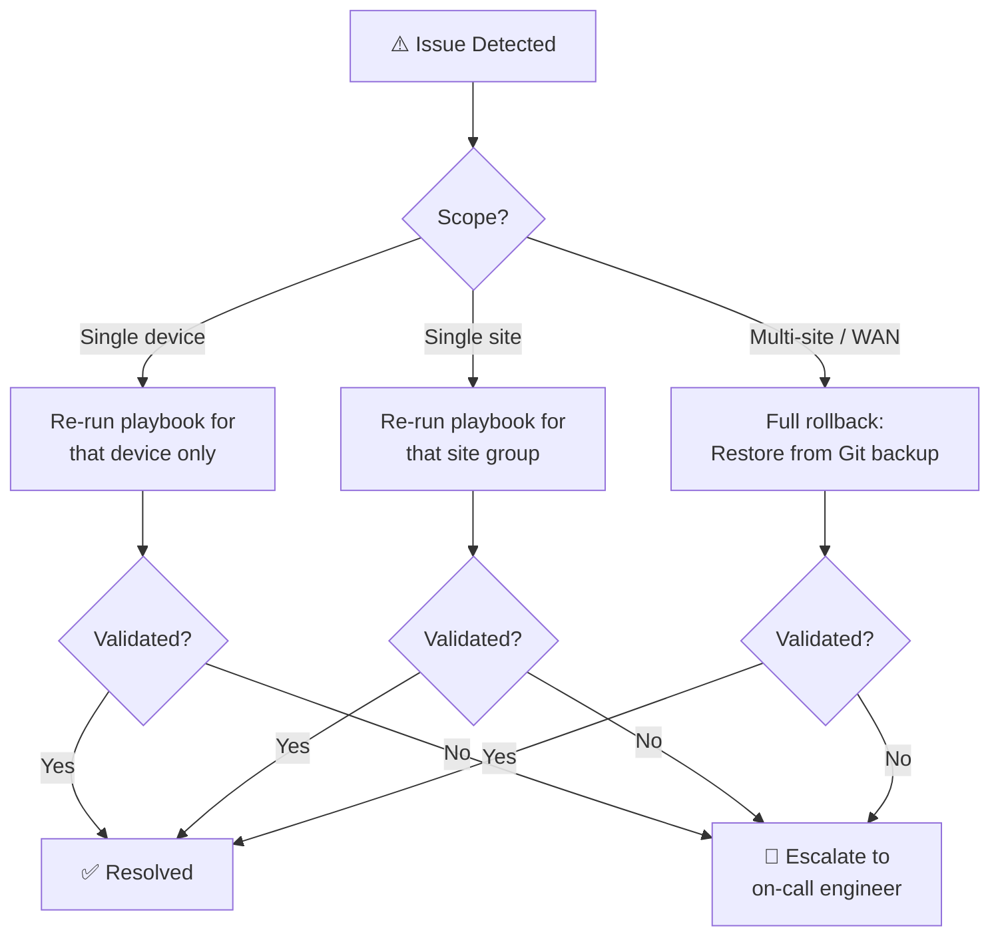

# Deployment Process — Gantt Chart

## Full Deployment Timeline (3 Offices)

```mermaid
gantt
    title Global Network Deployment — 3 Offices
    dateFormat  YYYY-MM-DD
    axisFormat  %b %d
    excludes    weekends

    section Phase 1: Procurement
    Order Hardware + Licenses     :done, p1a, 2025-01-02, 42d
    Receive & Unbox               :done, p1b, after p1a, 3d
    Rack & Stack (All Sites)      :done, p1c, after p1b, 2d

    section Phase 2: Platform Setup
    Deploy ESXi / Proxmox         :active, p2a, after p1c, 1d
    Create All VMs (DNA, ISE, etc) :active, p2b, after p2a, 2d
    Install DNA Center            :p2c, after p2b, 1d
    Install ISE (3 nodes)         :p2d, after p2b, 1d
    Install vManage/vSmart/vBond  :p2e, after p2b, 1d
    Install Graylog + OpenSearch  :p2f, after p2b, 1d
    Install Prometheus + Grafana  :p2g, after p2b, 0.5d
    Configure SLUP (Offline Lic)  :p2h, after p2c, 0.5d

    section Phase 3: Office A (HQ)
    Console: Hostname + Mgmt IP   :p3a, after p2h, 0.5d
    Ansible: Bootstrap (SSH/NTP)  :p3b, after p3a, 0.5d
    Ansible: Global Settings      :p3c, after p3b, 0.5d
    Ansible: Security Hardening   :p3d, after p3c, 0.5d
    Ansible: STP + LACP + VSS     :p3e, after p3d, 0.5d
    Ansible: VLANs + Subnets      :p3f, after p3e, 0.5d
    Ansible: BGP + OSPF + ECMP    :p3g, after p3f, 0.5d
    Ansible: SD-WAN Fabric        :p3h, after p3g, 1d
    Ansible: WLC SSO + WLANs      :p3i, after p3h, 0.5d
    ISE: Personas + pxGrid        :p3j, after p3i, 1d
    DNA Center: Site + Discovery  :p3k, after p3j, 1d
    Validation + Backup           :p3l, after p3k, 0.5d

    section Phase 4: Office B (Regional)
    Console: Hostname + Mgmt IP   :p4a, after p3l, 0.5d
    Ansible: Bootstrap            :p4b, after p4a, 0.5d
    Ansible: Full Config (1-11)   :p4c, after p4b, 2d
    WLC SSO + ISE PSN             :p4d, after p4c, 0.5d
    Validation + Backup           :p4e, after p4d, 0.5d

    section Phase 5: Office C (Branch)
    Console: Hostname + Mgmt IP   :p5a, after p4e, 0.5d
    Ansible: Bootstrap            :p5b, after p5a, 0.5d
    Ansible: Full Config          :p5c, after p5b, 1d
    FlexConnect + 4G Failover     :p5d, after p5c, 0.5d
    Validation + Backup           :p5e, after p5d, 0.5d

    section Phase 6: Integration
    End-to-End Testing            :crit, p6a, after p5e, 2d
    Failover Testing (All)        :crit, p6b, after p6a, 1d
    Security Audit                :p6c, after p6b, 1d
    Documentation Finalize        :p6d, after p6c, 1d
    Go-Live                       :milestone, m1, after p6d, 0d
```

## Per-Site Deployment Sequence

```mermaid
flowchart LR
    subgraph SITE["Each Site (A → B → C)"]
        A1["1. Console<br/>Hostname + IP"] --> A2["2. Bootstrap<br/>SSH + NTP + DNS"]
        A2 --> A3["3. Global<br/>Domain + AAA"]
        A3 --> A4["4. Security<br/>SSH + ACLs + Port Sec"]
        A4 --> A5["5. STP/LACP/VSS"]
        A5 --> A6["6. VLANs/SVIs"]
        A6 --> A7["7. Routing<br/>BGP/OSPF/HSRP"]
        A7 --> A8["8. SD-WAN<br/>vEdge + Tunnels"]
        A8 --> A9["9. WLC<br/>SSO/FlexConnect"]
        A9 --> A10["10. ISE<br/>pxGrid + SGT"]
        A10 --> A11["11. DNAC<br/>Site + Discovery"]
        A11 --> A12["12. Logging<br/>Syslog + SNMP"]
        A12 --> A13["13. Validate<br/>All Checks"]
        A13 --> A14["14. Backup<br/>Git Commit"]
    end
```

## Rollback Decision Tree

```mermaid
flowchart TD
    ISSUE["⚠️ Issue Detected"] --> SCOPE{"Scope?"}

    SCOPE -->|"Single device"| R1["Re-run playbook for<br/>that device only"]
    SCOPE -->|"Single site"| R2["Re-run playbook for<br/>that site group"]
    SCOPE -->|"Multi-site / WAN"| R3["Full rollback:<br/>Restore from Git backup"]

    R1 --> V1{"Validated?"}
    R2 --> V2{"Validated?"}
    R3 --> V3{"Validated?"}

    V1 -->|Yes| OK["✅ Resolved"]
    V1 -->|No| ESCALATE["🚨 Escalate to<br/>on-call engineer"]
    V2 -->|Yes| OK
    V2 -->|No| ESCALATE
    V3 -->|Yes| OK
    V3 -->|No| ESCALATE
```   
