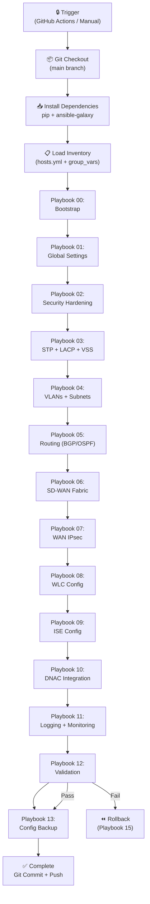
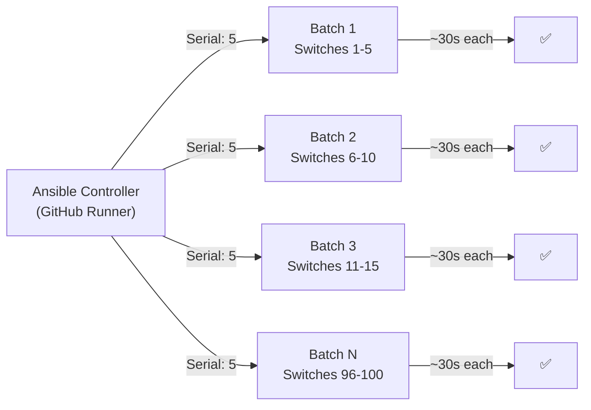
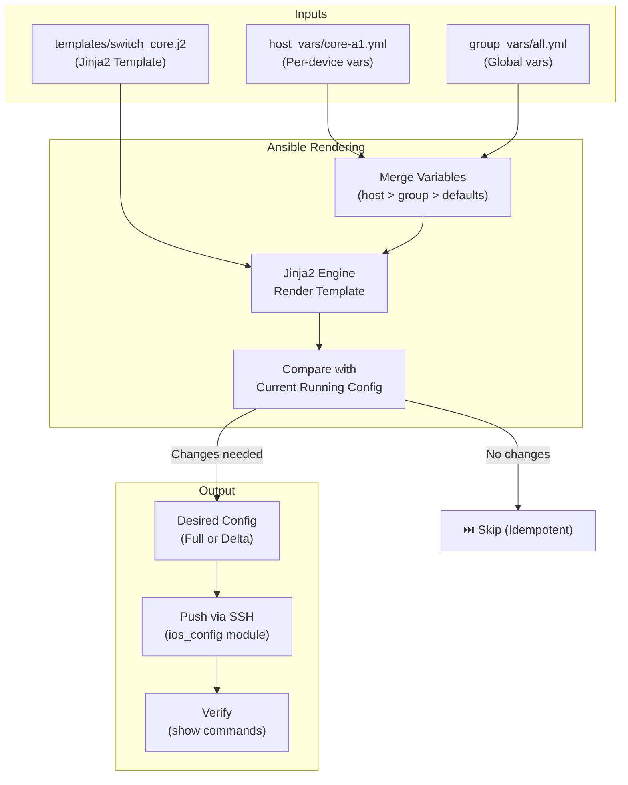

# Automation Flow — End-to-End

## Ansible Playbook Execution Flow

```mermaid
flowchart TD
    TRIGGER["🔒 Trigger<br/>(GitHub Actions / Manual)"] --> CHECKOUT["📦 Git Checkout<br/>(main branch)"]

    CHECKOUT --> INSTALL["📥 Install Dependencies<br/>pip + ansible-galaxy"]
    INSTALL --> INVENTORY["📋 Load Inventory<br/>(hosts.yml + group_vars)"]

    INVENTORY --> PB0["Playbook 00:<br/>Bootstrap"]
    PB0 --> PB1["Playbook 01:<br/>Global Settings"]
    PB1 --> PB2["Playbook 02:<br/>Security Hardening"]
    PB2 --> PB3["Playbook 03:<br/>STP + LACP + VSS"]
    PB3 --> PB4["Playbook 04:<br/>VLANs + Subnets"]
    PB4 --> PB5["Playbook 05:<br/>Routing (BGP/OSPF)"]
    PB5 --> PB6["Playbook 06:<br/>SD-WAN Fabric"]
    PB6 --> PB7["Playbook 07:<br/>WAN IPsec"]
    PB7 --> PB8["Playbook 08:<br/>WLC Config"]
    PB8 --> PB9["Playbook 09:<br/>ISE Config"]
    PB9 --> PB10["Playbook 10:<br/>DNAC Integration"]
    PB10 --> PB11["Playbook 11:<br/>Logging + Monitoring"]
    PB11 --> PB12["Playbook 12:<br/>Validation"]
    PB12 --> PB13["Playbook 13:<br/>Config Backup"]

    PB12 -->|Fail| ROLLBACK["⏪ Rollback<br/>(Playbook 15)"]
    PB12 -->|Pass| PB13
    PB13 --> DONE["✅ Complete<br/>Git Commit + Push"]
```

## Parallel Execution (100 Switches)

```mermaid
flowchart LR
    ANSIBLE["Ansible Controller<br/>(GitHub Runner)"]

    ANSIBLE -->|"Serial: 5"| GROUP1["Batch 1<br/>Switches 1-5"]
    ANSIBLE -->|"Serial: 5"| GROUP2["Batch 2<br/>Switches 6-10"]
    ANSIBLE -->|"Serial: 5"| GROUP3["Batch 3<br/>Switches 11-15"]
    ANSIBLE -->|"Serial: 5"| GROUP4["Batch N<br/>Switches 96-100"]

    GROUP1 -->|"~30s each"| DONE1["✅"]
    GROUP2 -->|"~30s each"| DONE2["✅"]
    GROUP3 -->|"~30s each"| DONE3["✅"]
    GROUP4 -->|"~30s each"| DONE4["✅"]
```

## Template Rendering Flow

```mermaid
flowchart TD
    subgraph INPUT["Inputs"]
        INVENTORY["host_vars/core-a1.yml<br/>(Per-device vars)"]
        GROUP["group_vars/all.yml<br/>(Global vars)"]
        TEMPLATES["templates/switch_core.j2<br/>(Jinja2 Template)"]
    end

    subgraph RENDER["Ansible Rendering"]
        COMBINE["Merge Variables<br/>(host > group > defaults)"]
        RENDER_J2["Jinja2 Engine<br/>Render Template"]
        DIFF["Compare with<br/>Current Running Config"]
    end

    subgraph OUTPUT["Output"]
        DESIRED["Desired Config<br/>(Full or Delta)"]
        APPLY["Push via SSH<br/>(ios_config module)"]
        VERIFY["Verify<br/>(show commands)"]
    end

    INVENTORY --> COMBINE
    GROUP --> COMBINE
    TEMPLATES --> RENDER_J2
    COMBINE --> RENDER_J2
    RENDER_J2 --> DIFF
    DIFF -->|"Changes needed"| DESIRED
    DIFF -->|"No changes"| SKIP["⏭️ Skip (Idempotent)"]
    DESIRED --> APPLY
    APPLY --> VERIFY
```   
