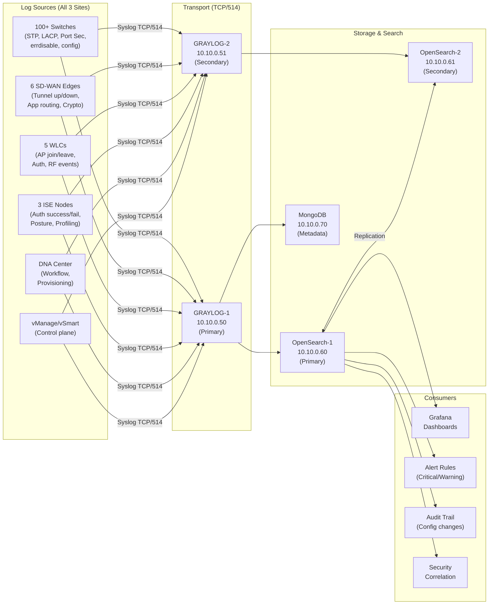
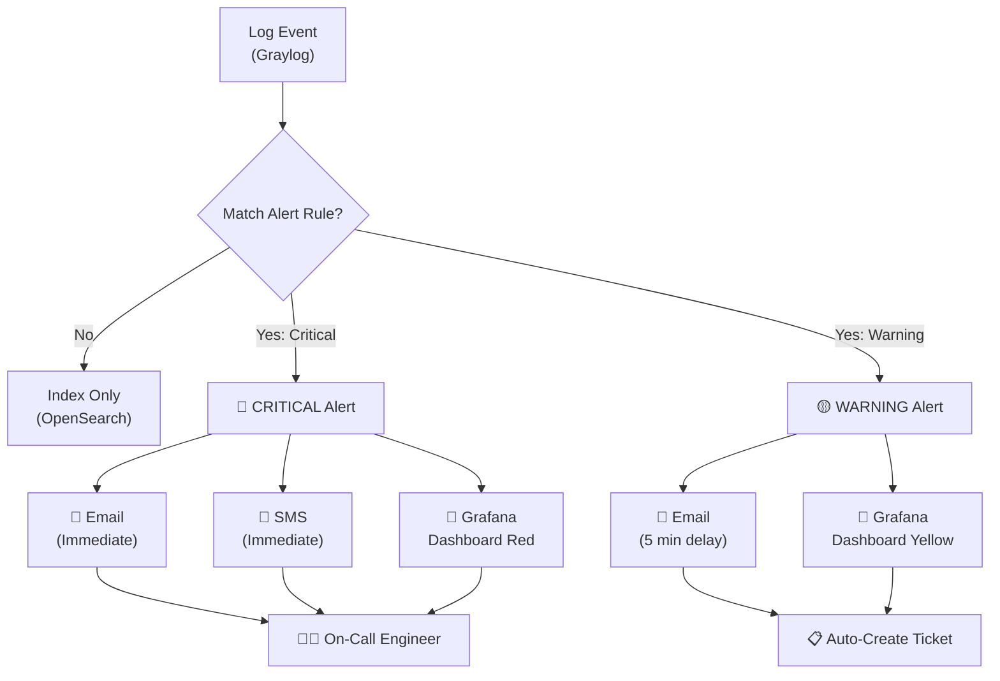
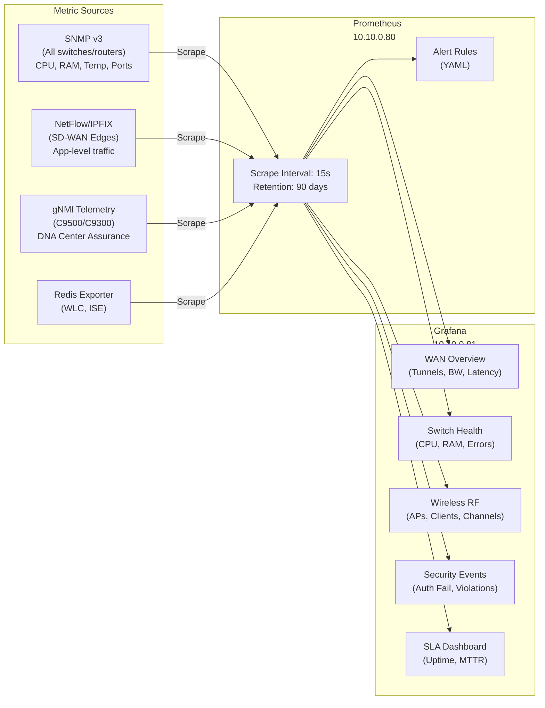
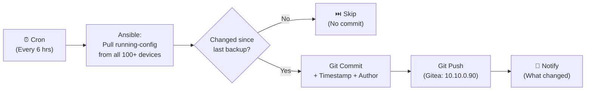

# Logging & Monitoring Architecture

## Log Flow (All Devices → Graylog → OpenSearch)

```mermaid
flowchart LR
    subgraph SOURCES["Log Sources (All 3 Sites)"]
        SW["100+ Switches<br/>(STP, LACP, Port Sec,<br/>errdisable, config)"]
        WAN["6 SD-WAN Edges<br/>(Tunnel up/down,<br/>App routing, Crypto)"]
        WLC["5 WLCs<br/>(AP join/leave,<br/>Auth, RF events)"]
        ISE["3 ISE Nodes<br/>(Auth success/fail,<br/>Posture, Profiling)"]
        DNAC["DNA Center<br/>(Workflow,<br/>Provisioning)"]
        VM["vManage/vSmart<br/>(Control plane)"]
    end

    subgraph TRANSPORT["Transport (TCP/514)"]
        GL1["GRAYLOG-1<br/>10.10.0.50<br/>(Primary)"]
        GL2["GRAYLOG-2<br/>10.10.0.51<br/>(Secondary)"]
    end

    subgraph STORAGE["Storage & Search"]
        OS1["OpenSearch-1<br/>10.10.0.60<br/>(Primary)"]
        OS2["OpenSearch-2<br/>10.10.0.61<br/>(Secondary)"]
        MONGO["MongoDB<br/>10.10.0.70<br/>(Metadata)"]
    end

    subgraph CONSUMERS["Consumers"]
        DASH["Grafana<br/>Dashboards"]
        ALERT["Alert Rules<br/>(Critical/Warning)"]
        AUDIT["Audit Trail<br/>(Config changes)"]
        SIEM["Security<br/>Correlation"]
    end

    SW & WAN & WLC & ISE & DNAC & VM -->|"Syslog TCP/514"| GL1
    SW & WAN & WLC & ISE & DNAC & VM -->|"Syslog TCP/514"| GL2

    GL1 --> OS1
    GL2 --> OS2
    GL1 --> MONGO
    OS1 <-->|"Replication"| OS2

    OS1 --> DASH
    OS1 --> ALERT
    OS1 --> AUDIT
    OS1 --> SIEM
```

## Alert Flow

```mermaid
flowchart TD
    EVENT["Log Event<br/>(Graylog)"] --> MATCH{"Match Alert Rule?"}

    MATCH -->|"No"| INDEX["Index Only<br/>(OpenSearch)"]

    MATCH -->|"Yes: Critical"| CRIT["🔴 CRITICAL Alert"]
    MATCH -->|"Yes: Warning"| WARN["🟡 WARNING Alert"]

    CRIT --> NOTIFY1["📧 Email<br/>(Immediate)"]
    CRIT --> NOTIFY2["📱 SMS<br/>(Immediate)"]
    CRIT --> NOTIFY3["🔔 Grafana<br/>Dashboard Red"]

    WARN --> NOTIFY4["📧 Email<br/>(5 min delay)"]
    WARN --> NOTIFY5["🔔 Grafana<br/>Dashboard Yellow"]

    NOTIFY1 & NOTIFY2 & NOTIFY3 --> ONCALL["👨‍🔧 On-Call Engineer"]
    NOTIFY4 & NOTIFY5 --> TICKET["📋 Auto-Create Ticket"]
```

## Metrics Collection (Prometheus + Grafana)

```mermaid
flowchart LR
    subgraph SOURCES["Metric Sources"]
        SNMP["SNMP v3<br/>(All switches/routers)<br/>CPU, RAM, Temp, Ports"]
        NETFLOW["NetFlow/IPFIX<br/>(SD-WAN Edges)<br/>App-level traffic"]
        GNMI["gNMI Telemetry<br/>(C9500/C9300)<br/>DNA Center Assurance"]
        REDIS["Redis Exporter<br/>(WLC, ISE)"]
    end

    subgraph PROM["Prometheus<br/>10.10.0.80"]
        SCRAPE["Scrape Interval: 15s<br/>Retention: 90 days"]
        RULES["Alert Rules<br/>(YAML)"]
    end

    subgraph GRAFANA["Grafana<br/>10.10.0.81"]
        D1["WAN Overview<br/>(Tunnels, BW, Latency)"]
        D2["Switch Health<br/>(CPU, RAM, Errors)"]
        D3["Wireless RF<br/>(APs, Clients, Channels)"]
        D4["Security Events<br/>(Auth Fail, Violations)"]
        D5["SLA Dashboard<br/>(Uptime, MTTR)"]
    end

    SNMP & NETFLOW & GNMI & REDIS -->|"Scrape"| SCRAPE
    SCRAPE --> RULES
    SCRAPE --> D1 & D2 & D3 & D4 & D5
```

## Config Backup Flow (Git)

```mermaid
flowchart LR
    SCHEDULE["⏰ Cron<br/>(Every 6 hrs)"] --> PULL["Ansible:<br/>Pull running-config<br/>from all 100+ devices"]

    PULL --> DIFF{"Changed since<br/>last backup?"}
    DIFF -->|"No"| SKIP["⏭️ Skip<br/>(No commit)"]
    DIFF -->|"Yes"| COMMIT["Git Commit<br/>+ Timestamp + Author"]

    COMMIT --> PUSH["Git Push<br/>(Gitea: 10.10.0.90)"]
    PUSH --> NOTIFY["📧 Notify<br/>(What changed)"]
```   
