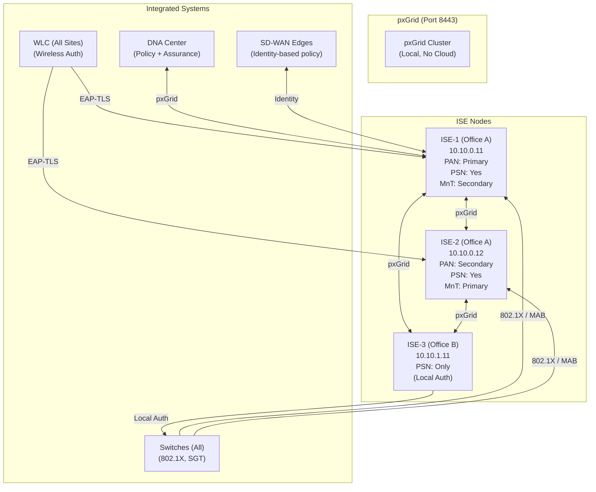
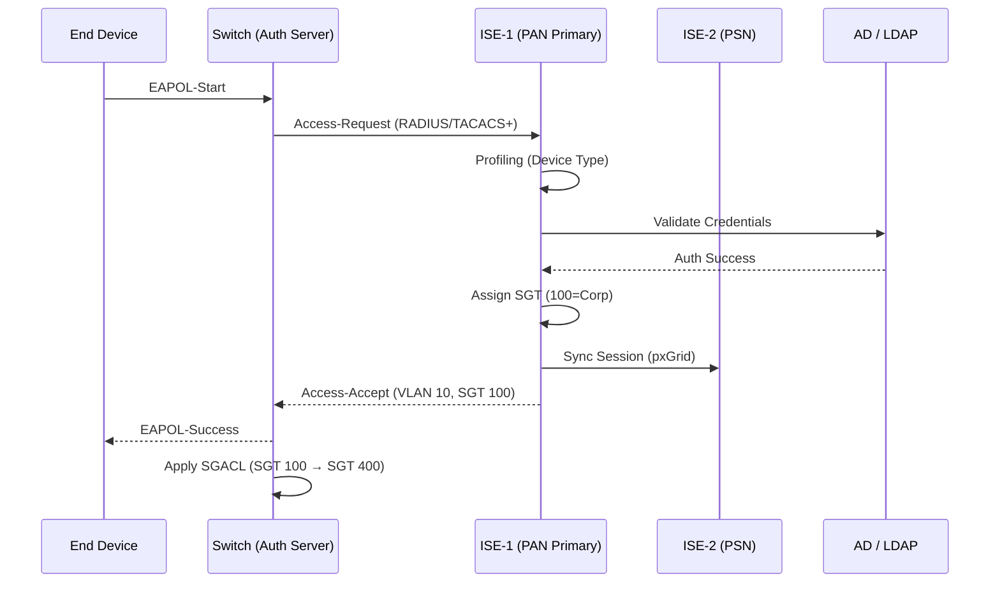
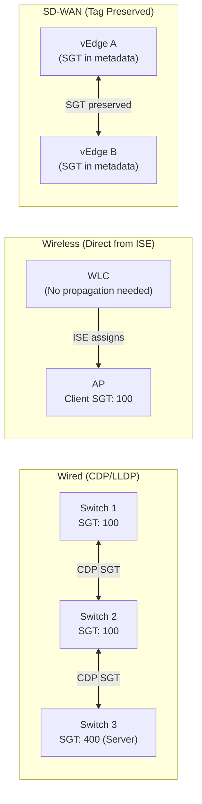
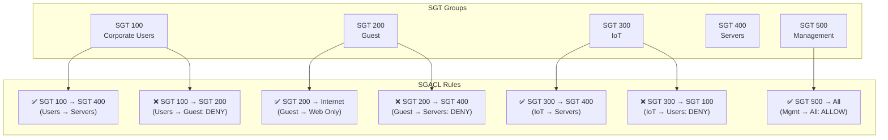

# ISE + pxGrid Architecture

## ISE Node Roles & pxGrid

```mermaid
flowchart TB
    subgraph ISE_NODES["ISE Nodes"]
        ISE1["ISE-1 (Office A)<br/>10.10.0.11<br/>PAN: Primary<br/>PSN: Yes<br/>MnT: Secondary"]
        ISE2["ISE-2 (Office A)<br/>10.10.0.12<br/>PAN: Secondary<br/>PSN: Yes<br/>MnT: Primary"]
        ISE3["ISE-3 (Office B)<br/>10.10.1.11<br/>PSN: Only<br/>(Local Auth)"]
    end

    subgraph PXGRID["pxGrid (Port 8443)"]
        PG["pxGrid Cluster<br/>(Local, No Cloud)"]
    end

    subgraph INTEGRATED["Integrated Systems"]
        WLC["WLC (All Sites)<br/>(Wireless Auth)"]
        DNAC["DNA Center<br/>(Policy + Assurance)"]
        SW["Switches (All)<br/>(802.1X, SGT)"]
        SDWAN["SD-WAN Edges<br/>(Identity-based policy)"]
    end

    ISE1 <-->|"pxGrid"| ISE2
    ISE1 <-->|"pxGrid"| ISE3
    ISE2 <-->|"pxGrid"| ISE3

    SW -->|"802.1X / MAB"| ISE1
    SW -->|"802.1X / MAB"| ISE2
    WLC -->|"EAP-TLS"| ISE1
    WLC -->|"EAP-TLS"| ISE2
    ISE3 -->|"Local Auth"| SW
    DNAC <-->|"pxGrid"| ISE1
    SDWAN <-->|"Identity"| ISE1
```

## Authentication Flow (802.1X)

```mermaid
sequenceDiagram
    participant Client as End Device
    participant SW as Switch (Auth Server)
    participant ISE1 as ISE-1 (PAN Primary)
    participant ISE2 as ISE-2 (PSN)
    participant AD as AD / LDAP

    Client->>SW: EAPOL-Start
    SW->>ISE1: Access-Request (RADIUS/TACACS+)
    ISE1->>ISE1: Profiling (Device Type)
    ISE1->>AD: Validate Credentials
    AD-->>ISE1: Auth Success
    ISE1->>ISE1: Assign SGT (100=Corp)
    ISE1->>ISE2: Sync Session (pxGrid)
    ISE1-->>SW: Access-Accept (VLAN 10, SGT 100)
    SW-->>Client: EAPOL-Success
    SW->>SW: Apply SGACL (SGT 100 → SGT 400)
```

## SGT Propagation

```mermaid
flowchart LR
    subgraph WIRED["Wired (CDP/LLDP)"]
        SW1["Switch 1<br/>SGT: 100"]
        SW2["Switch 2<br/>SGT: 100"]
        SW3["Switch 3<br/>SGT: 400 (Server)"]
    end

    subgraph WIRELESS["Wireless (Direct from ISE)"]
        WLC1["WLC<br/>(No propagation needed)"]
        AP1["AP<br/>Client SGT: 100"]
    end

    subgraph SDWAN_LAYER["SD-WAN (Tag Preserved)"]
        EDGE1["vEdge A<br/>(SGT in metadata)"]
        EDGE2["vEdge B<br/>(SGT in metadata)"]
    end

    SW1 <-->|"CDP SGT"| SW2
    SW2 <-->|"CDP SGT"| SW3
    WLC1 -->|"ISE assigns"| AP1
    EDGE1 <-->|"SGT preserved"| EDGE2
```

## TrustSec SGACL Matrix

```mermaid
flowchart TB
    subgraph SGT["SGT Groups"]
        S100["SGT 100<br/>Corporate Users"]
        S200["SGT 200<br/>Guest"]
        S300["SGT 300<br/>IoT"]
        S400["SGT 400<br/>Servers"]
        S500["SGT 500<br/>Management"]
    end

    subgraph ACL["SGACL Rules"]
        R1["✅ SGT 100 → SGT 400<br/>(Users → Servers)"]
        R2["❌ SGT 100 → SGT 200<br/>(Users → Guest: DENY)"]
        R3["✅ SGT 200 → Internet<br/>(Guest → Web Only)"]
        R4["✅ SGT 300 → SGT 400<br/>(IoT → Servers)"]
        R5["✅ SGT 500 → All<br/>(Mgmt → All: ALLOW)"]
        R6["❌ SGT 200 → SGT 400<br/>(Guest → Servers: DENY)"]
        R7["❌ SGT 300 → SGT 100<br/>(IoT → Users: DENY)"]
    end

    S100 --> R1
    S100 --> R2
    S200 --> R3
    S200 --> R6
    S300 --> R4
    S300 --> R7
    S500 --> R5
```   
